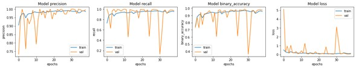
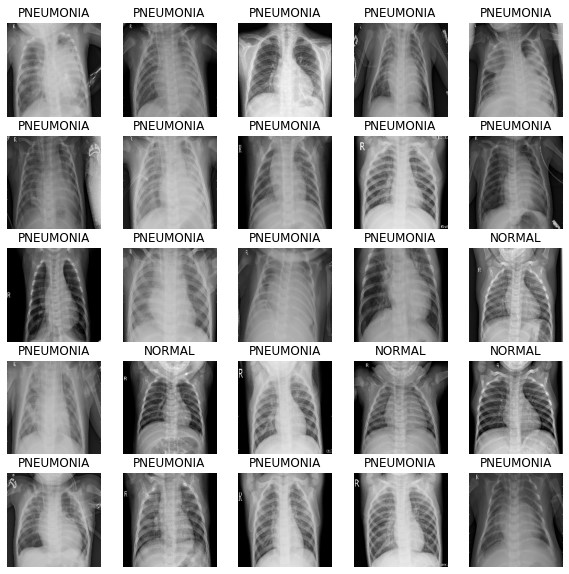

## Tools and Technologies Used

 
 
 
 

## Key Results

 

 

 

 

These results indicate a high performance of the model in distinguishing between normal and pneumonia-affected X-ray images.

## Model Architecture

- **Base Model**: Utilized a pre-trained InceptionV3 model on ImageNet, which was fine-tuned on the X-ray dataset to improve its sensitivity and specificity for pneumonia classification.
- **Layers Added**: Custom dense layers added to adapt the model to the binary classification task.
- **Optimizer**: Adam optimizer with a learning rate scheduler to ensure efficient training.
- **Loss Function**: Binary cross-entropy to handle the two-class problem.

## Dataset

- **Source**: The dataset used in this project is from the [Chest X-Ray Images (Pneumonia)](https://www.cell.com/cell/fulltext/S0092-8674(18)30154-5), which is a publicly available dataset consisting of 5,863 X-ray images.
- **Classes**: The dataset contains two classes: "NORMAL" and "PNEUMONIA".
- **Preprocessing**: Images were resized to 180x180 pixels, and data augmentation was applied to improve model generalization.

* * *

## 🚀 **Explore More Projects!**

### [📚 Check out all my projects on GitHub Pages](https://alxmares.github.io)

* * *
